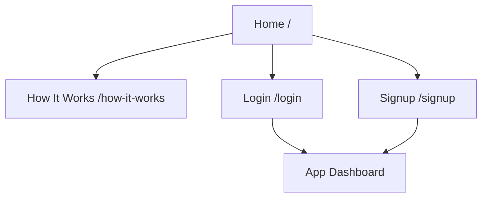
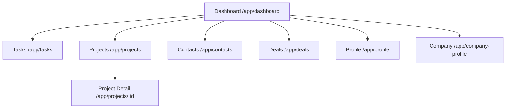
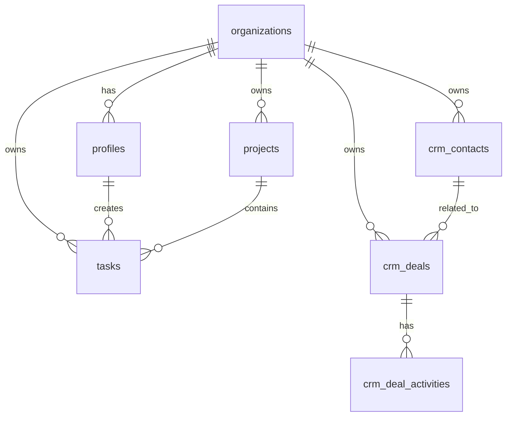
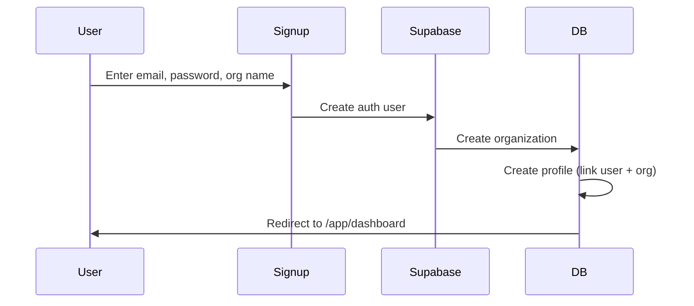
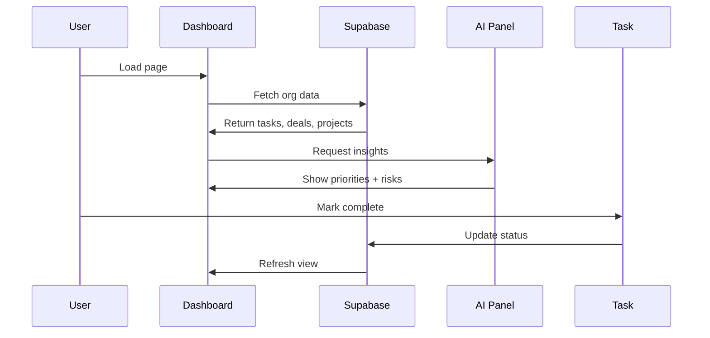
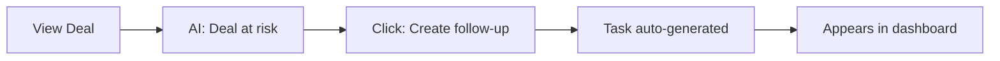
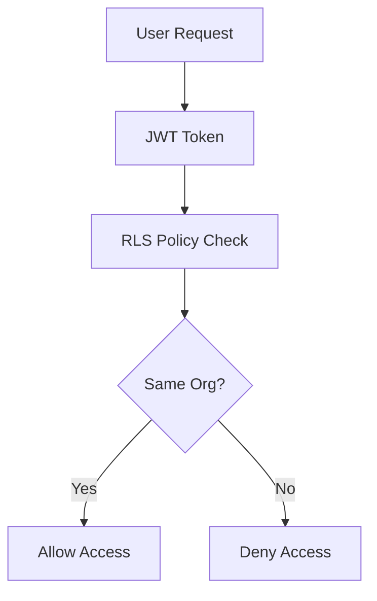
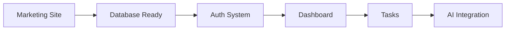
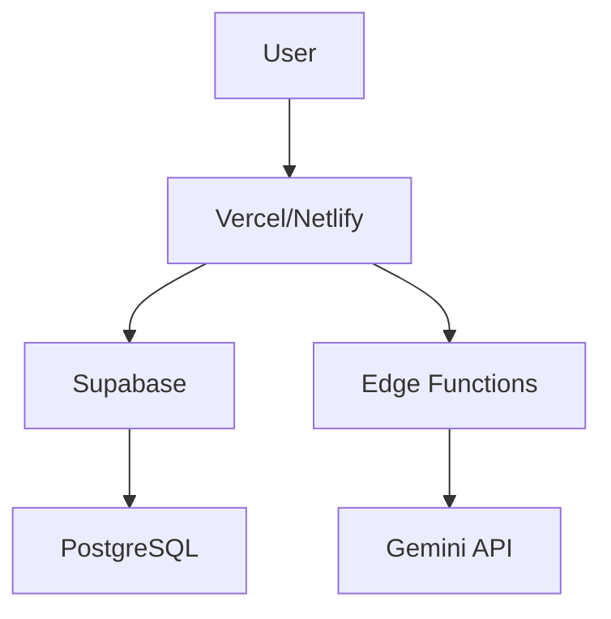

# StartupAI - Technical Overview

**Version:** 0.2.0  
**Last Updated:** January 13, 2025  
**Status:** Foundation Complete (25%)

---

## Tech Stack

### Frontend Core
- **React** 18.3.1
- **TypeScript** 5.6.2
- **Vite** 6.0.11 (Build tool)
- **Tailwind CSS** 4.0.0 (Styling)

### UI & Animation
- **Motion** (Framer Motion) - Scroll animations
- **Lucide React** - Icon library
- **date-fns** - Date formatting

### Backend & Data
- **Supabase** 2.39.0+ (PostgreSQL, Auth, RLS)
- **React Router DOM** 6.21.0+ (Routing)

### AI & Intelligence (Planned)
- **Google Gemini 3 Pro** (Strategy, analysis)
- **Google Gemini 3 Flash** (Quick insights)

---

## Directory Structure

```
/
├── public/                  # Static assets
├── src/
│   ├── components/          # React components
│   │   ├── app/            # App-specific (nav, layout)
│   │   ├── dashboard/      # Dashboard widgets
│   │   ├── how-it-works/   # Marketing page sections
│   │   └── hooks/          # Custom React hooks
│   ├── contexts/           # React contexts (auth, org)
│   ├── lib/                # Utilities (supabase client)
│   ├── pages/              # Page components
│   │   ├── app/           # Protected app pages
│   │   └── [public pages] # Marketing pages
│   ├── types/              # TypeScript definitions
│   ├── App.tsx             # Root component
│   └── main.tsx            # Entry point
├── docs/
│   ├── dashboards/         # Implementation guides
│   ├── supabase/           # Database docs
│   │   └── migrations/    # SQL migrations
│   ├── PROGRESS.md         # Status tracker
│   ├── NEXT_STEPS.md       # Action plan
│   └── 01-overview.md      # This file
├── .env                    # Environment variables
└── package.json            # Dependencies
```

---

## Application Sitemap

### Public Website (Marketing)


### Protected App (Post-Login)


---

## Routing Architecture

### Public Routes (Unauthenticated)
- `/` - Marketing homepage
- `/how-it-works` - Product explanation
- `/login` - User login
- `/signup` - New user registration

### Protected Routes (Authenticated)
- `/app/*` - All app routes require auth
- `/app/dashboard` - Main dashboard (3-panel)
- `/app/tasks` - Task management hub
- `/app/projects` - Projects overview
- `/app/projects/:id` - Project detail
- `/app/contacts` - CRM contacts
- `/app/deals` - Deal pipeline
- `/app/profile` - User settings
- `/app/company-profile` - Organization settings

### Route Guards
- **ProtectedRoute** - Redirects to `/login` if not authenticated
- **AuthProvider** - Manages user/org context globally

---

## Database Schema

### Tables (7 Core)


**Tables:**
- **organizations** - Multi-tenant orgs
- **profiles** - User profiles (linked to auth)
- **tasks** - 5-step workflow tasks
- **projects** - Initiative tracking
- **crm_contacts** - Investors, customers, advisors
- **crm_deals** - Pipeline management
- **crm_deal_activities** - Interaction logs

---

## User Workflows

### Onboarding Flow


### Daily Dashboard Flow


### CRM → Task Creation Flow


---

## Frontend Architecture

### Page Types

**Marketing Pages:**
- Homepage (6 sections)
- How It Works (8 sections)
- Footer with navigation

**App Pages (3-Panel Layout):**
```
┌─────────┬──────────────────┬─────────────┐
│  Left   │      Main        │    Right    │
│ Context │      Work        │Intelligence │
│  (Nav)  │   (Widgets)      │ (AI Panel)  │
└─────────┴──────────────────┴─────────────┘
```

**Dashboard Widgets:**
- DashboardHeader (greeting, date)
- KPIBar (MRR, runway, deals, tasks)
- PrioritiesCard (top 3 tasks)
- RisksCard (overdue, stalled)
- QuickActions (create shortcuts)
- AIPanel (insights, suggestions)

---

## Backend Architecture

### Supabase Services

**Authentication:**
- Email/password signup
- Session management
- JWT-based auth
- Automatic org creation

**Database:**
- PostgreSQL with RLS
- Org-isolated data
- Real-time subscriptions (planned)
- Automated backups

**Edge Functions (Planned):**
- `dashboard-summary` - Aggregate data
- `ai-insights` - Gemini integration
- `generate-tasks` - AI task creation
- `crm-followup` - Automated reminders

---

## Security Model

### Row Level Security (RLS)


**Policies:**
- Every table enforces org_id matching
- Service role bypasses RLS (Edge Functions only)
- No cross-org data leakage

---

## Features Breakdown

### ✅ Implemented (v0.1-0.2)
- Marketing website (2 pages)
- Design system (beige, coral, serif)
- Database schema (7 tables)
- RLS policies
- Seed data
- Documentation system

### 🚧 In Progress (v0.3)
- Authentication (signup, login)
- Main dashboard
- Task widgets
- Protected routing

### 📋 Planned (v0.4-0.6)
- Task CRUD operations
- CRM contact management
- Deal pipeline
- AI integration (Gemini)
- Edge Functions
- Real-time updates

---

## Design System

### Colors
- **Background:** #FAF7F4 (warm beige)
- **Accent:** #E85D4A (coral)
- **Text:** #1a1614 (charcoal)
- **Secondary:** #6B6560 (gray)

### Typography
- **Headlines:** Crimson Pro (serif, light)
- **Body:** System sans-serif (light)

### Components
- Glassmorphic cards (backdrop-blur)
- Subtle shadows
- Rounded corners (xl)
- Generous spacing

---

## Development Workflow

### Current State (v0.2)


### Next Steps (Sequential)
1. **Deploy migrations** (30 min)
2. **Install dependencies** (10 min)
3. **Build auth** (4 hours)
4. **Create dashboard** (8 hours)
5. **Add task system** (1 day)
6. **Integrate AI** (2 days)

---

## Performance Targets

- **Dashboard load:** <500ms
- **Task creation:** <1s
- **AI response:** <2s
- **Bundle size:** <500KB

---

## Deployment Architecture (Planned)



---

## AI Agent System (Planned)

**Agents:**
- **Orchestrator** - Routes context
- **Planner** - Generates task lists
- **Analyst** - Detects risks
- **Scorer** - Calculates priorities
- **Optimizer** - Improves timelines
- **Retriever** - RAG for docs
- **Controller** - Human approval gate

---

## Monitoring & Analytics (Planned)

- Supabase built-in metrics
- User behavior tracking
- Error logging
- Performance monitoring
- AI quality metrics

---

**Status:** Ready for Phase 1 implementation  
**Next Milestone:** Auth + Dashboard (Week 1)  
**Documentation:** `/docs/NEXT_STEPS.md`
